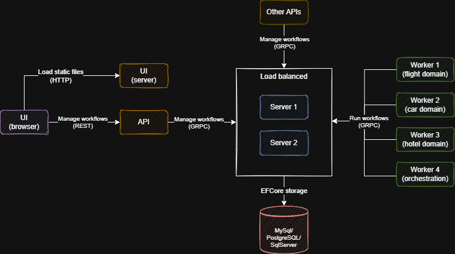
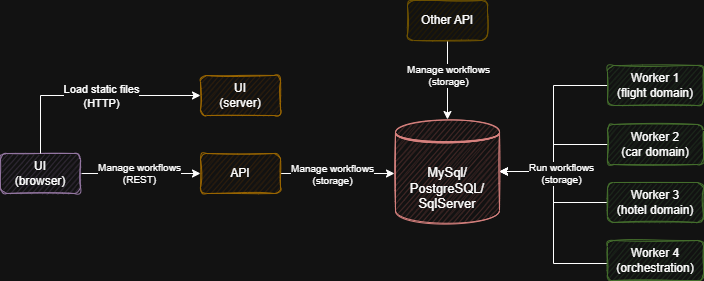
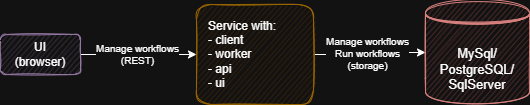
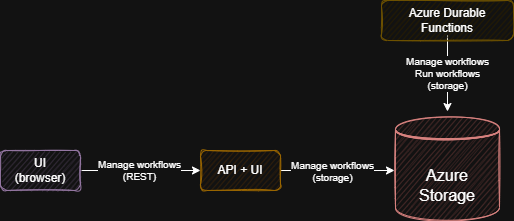

# Durable Task Extensions

**NOTE:** THIS IS A PROTOTYPE, NOT PRODUCTION READY.

## Introduction

This project aims to extend [Durable Task Framework](https://github.com/Azure/durabletask) with more features and make it easier to use.

Scope:
- More interfaces defining storage features
- Dependency injection integration
- EF Core MySql/PostgreSQL/SqlServer storages
- Distributed workers: Allows splitting orchestrations/activities implementation in multiple workers
- Indirect storage access via GRPC protocol: Centralize your storage choice and configuration in a single component.
- UI
- BPMN runner (not sure yet)

## Motivation

[Durable Task Framework](https://github.com/Azure/durabletask) is an open source framework that provides a foundation for workflow as code in .NET platform.

[Azure Durable Functions](https://docs.microsoft.com/en-us/azure/azure-functions/durable/durable-functions-overview)  connects Durable Task Framework to Azure serverless platform, making it simpler to create workflows as code.

The concepts of Durable Functions led to the development of [Cadence](https://cadenceworkflow.io/). A platform that brings Durable Functions to other programming languages and extends it with concepts for better microservices orchestration, like tasks lists and distributed workers.

Because of the bad integration of Cadence with .NET platform, I decided to try to add to Durable Task Framework the features I like from Cadence.

NOTE: Cadence was recently forked by one of it's creators and [Temporal](https://temporal.io/) was created, backed by a company focused on evolving the platform. That might change this landscape in a short term.

## Components

### LLL.DurableTask.Core [](https://www.nuget.org/packages/LLL.DurableTask.Core/)

Extends Durable Task Core with more interfaces and features:
- [IExtendedOrchestrationService](src/LLL.DurableTask.Core/IExtendedOrchestrationService.cs):
    - Lock and execute specific orchestrations
    - Lock and execute specific activities
- [IExtendedOrchestrationServiceClient](src/LLL.DurableTask.Core/IExtendedOrchestrationServiceClient.cs):
    - Search orchestrations
    - Purge orchestration instance history

### LLL.DurableTask.AzureStorage [](https://www.nuget.org/packages/LLL.DurableTask.AzureStorage/)

Extends Durable Task Azure storage with:
- Dependency Injection
- Adapter implementing IExtendedOrchestrationServiceClient interface

Supported features:

- UI: yes
- Distributed workers: no
- Storing activity input: no

Configuration:
```C#
services.AddDurableTaskAzureStorage(options =>
{
    options.TaskHubName = "Test";
    options.StorageConnectionString = "UseDevelopmentStorage=true";
});
```

### LLL.DurableTask.Emulator [](https://www.nuget.org/packages/LLL.DurableTask.Emulator/)

Extends Durable Task Emulator storage with:
- Dependency Injection

Supported features:

- UI: no
- Distributed workers: no
- Storing activity input: no

Configuration:
```C#
services.AddDurableTaskEmulatorStorage();
```

### LLL.DurableTask.EFCore [](https://www.nuget.org/packages/LLL.DurableTask.EFCore/)

Implements relational relational database storage using EFCore.

The implementation uses a combination of **row locking**, **skip locked** and **polling** to implement queues.

Supported features:

- UI: yes
- Distributed workers: yes
- Storing activity input: true

#### LLL.DurableTask.EFCore.MySql [](https://www.nuget.org/packages/LLL.DurableTask.EFCore.MySql/)

Extension to EFCore storage with migrations and queries specific to MySql.

Configuration:
```C#
services.AddDurableTaskEFCoreStorage()
    .UseMySql("YOUR_CONNECTION_STRING");
```

#### LLL.DurableTask.EFCore.PostgreSQL [](https://www.nuget.org/packages/LLL.DurableTask.EFCore.PostgreSQL/)

Extension to EFCore storage with migrations and queries specific to PostgreSQL.

Configuration:
```C#
services.AddDurableTaskEFCoreStorage()
    .UseNpgsql("YOUR_CONNECTION_STRING");
```

#### LLL.DurableTask.EFCore.SqlServer [](https://www.nuget.org/packages/LLL.DurableTask.EFCore.SqlServer/)

Extension to EFCore storage with migrations and queries specific to Sql Server.

Configuration:
```C#
services.AddDurableTaskEFCoreStorage()
    .UseSqlServer("YOUR_CONNECTION_STRING");
```

### LLL.DurableTask.Client [](https://www.nuget.org/packages/LLL.DurableTask.Client/)

Dependency injection extensions to configure TaskHubClient.

Allows management of orchestrations via code.

Depends on:

- Storage

Configuration:

```C#
services.AddDurableTaskClient();
```

Usage:

```C#
public IActionResult BookPackage([FromService] TaskHubClient taskHubClient) {
    await taskHubClient.CreateOrchestrationInstanceAsync("BookParallel", "v1", new {
        bookFlight: true,
        bookHotel: true,
        bookCar: true
    });
    ...
}
```

### LLL.DurableTask.Worker [](https://www.nuget.org/packages/LLL.DurableTask.Worker/)

Dependency injection extensions to configure TaskHubWorker.

Allows execution of orchestration/activity tasks.

A service scope is created for each orchestration and activity execution.

Orchestrations/activities/middlewares supports dependency injection.

Depends on:

- Storage

Configuration:

```C#
services.AddDurableTaskWorker(builder =>
{
    // Add orchestration with default name and version
    builder.AddOrchestration<BookParallel>();

    // Add orchestration with specific name and version
    builder.AddOrchestration<BookParallel>("BookParallel", "v1");

    // Add activity with default name and version
    builder.AddActivity<BookHotelActivity>();

    // Add activity with specific name and version
    builder.AddActivity<BookHotelActivity>("BookHotel", "v1");
});
```

Or you can also scan an assembly to add all orchestrations and/or activities marked with attributes [OrchestrationAttribute](src/LLL.DurableTask.Worker/Attributes/OrchestrationAttribute.cs) or [ActivityAttribute](src/LLL.DurableTask.Worker/Attributes/ActivityAttribute.cs):
```C#
services.AddDurableTaskWorker(builder =>
{
    // Adds all orchestrations and activities from assembly
    builder.AddFromAssembly(typeof(Startup).Assembly);

    // Add only orchestrationsfrom assembly
    builder.AddOrchestrationsFromAssembly(typeof(Startup).Assembly);
    
    // Add only orchestrationsfrom assembly
    builder.AddActivitiesFromAssembly(typeof(Startup).Assembly);
});
```

**NOTE:** When using storages that doesn't support distributed workers, make sure all your orchestrations and activities are implemented in the same worker and add the following lines to your worker configuration:

```C#
services.AddDurableTaskWorker(builder =>
{
    ...
    builder.HasAllOrchestrations = true;
    builder.HasAllActivities = true;
});
```

### LLL.DurableTask.Server [](https://www.nuget.org/packages/LLL.DurableTask.Server/)

Expose any storage implementation as API.

Allow microservices to connect to an API instead of directly to storage.

Depends on:

- Storage

#### LLL.DurableTask.Server.Grpc [](https://www.nuget.org/packages/LLL.DurableTask.Server.Grpc/)

GRPC endpoints for server.

The chatty orchestration execution communication is done with bidirectional streaming, maintaining the orchestration session alive in the server side.

Activity execution and all remaining communication is done with non streamed rpc.

Configuration:
```C#
services.AddDurableTaskServer(builder =>
{
    builder.AddGrpcEndpoints();
});
...
app.UseEndpoints(endpoints =>
{
    endpoints.MapDurableTaskServerGrpcService();
});
```

#### LLL.DurableTask.Server.Grpc.Client [](https://www.nuget.org/packages/LLL.DurableTask.Server.Grpc.Client/)

Durable Task storage implementation using server GRPC endpoints.

Supports same features as the storage configured in the server.

Configuration:
```C#
services.AddDurableTaskServerGrpcStorage(options =>
{
    options.BaseAddress = new Uri("YOUR_SERVER_ADDRESS");
});
```

### LLL.DurableTask.Api [](https://www.nuget.org/packages/LLL.DurableTask.Api/)

Exposes orchestration management operations in a REST API.

Depends on:

- Storage
- Client

Configuration:
```C#
services.AddDurableTaskApi();
...
app.UseEndpoints(endpoints =>
{
    endpoints.MapDurableTaskApi();
});
```

### LLL.DurableTask.Ui [](https://www.nuget.org/packages/LLL.DurableTask.Ui/)

Beautifull UI to manage orchestrations built with React + Material UI.

Take a look in the [screenshots](readme/screenshots.md). History visualization is my favorite :-)

The UI is hosted by default under /tasks path of your api.

Configuration:
```C#
services.AddDurableTaskUI();
...
app.UseDurableTaskUI();
```

## Compose components to build your own architecture

### Microservices with server



### Microservices with direct storage connection



### Single service



### UI for Durable Functions



## Sample

Inside the [sample](samples) folder you will find an implementation of the classic book Flight, Car, Hotel with compensation problem.

The sample was built to demonstrate a microservices architecture with the following components:

- **Server:** Connects to storage and exposes it as GRPC endpoints.
- **UI:** Exposes API and UI static files.
- **OrchestrationWorker:** Implements [BookParallel](samples/OrchestrationWorker/Orchestrations/BookParallelOrchestration.cs) and [BookSquential](samples/OrchestrationWorker/Orchestrations/BookSequentialOrchestration.cs) orchestrations for the given problem.
- **FlightWorker:** Implements [BookFlight](samples/FlightWorker/Activities/BookFlightActivity.cs) and [CancelFlight](samples/CarWorker/Activities/CancelFlightActivity.cs) activities.
- **CarWorker:** Implements [BookCar](samples/CarWorker/Activities/BookCarActivity.cs) and [CancelCar](samples/CarWorker/Activities/CancelCarActivity.cs) activities.
- **HotelWorker:** Implements [BookHotel](samples/HotelWorker/Activities/BookHotelActivity.cs) and [CancelHotel](samples/HotelWorker/Activities/CancelHotelActivity.cs) activities.
- **BPMNWorker:** An experimental BPMN runner built on top of Durable Tasks. There are also [BookParallel](samples/BpmnWorker/Workflows/BookParallel.bpmn) and [BookSequential](samples/BpmnWorker/Workflows/BookSequential.bpmn) BPMN workflows for the given problem.

### Runinng the sample

1. Configure a EFCore storage at the [server](samples/Server/Startup.cs#L37)
2. Simultaneously run all the projects listed above
3. Open the UI at https://localhost:5002/tasks
4. Create the following test orchestrations and watch them be executed
    | Name | Version | InstanceId | Input |
    | --- | --- | --- | --- |
    | BookParallel | v1 | (Empty) | (Empty) |
    | BookSequential | v1 | (Empty) | (Empty) |
    | BPMN | (Empty) | (Empty) | { "name": "BookParallel" }
    | BPMN | (Empty) | (Empty) | { "name": "BookSequential" }
    | BPMN | (Empty) | (Empty) | { "name": "Bonus" }

Note: The Orchestration state screen doesn't refresh automatically yet. Reload the page to see progress in workflow execution.
