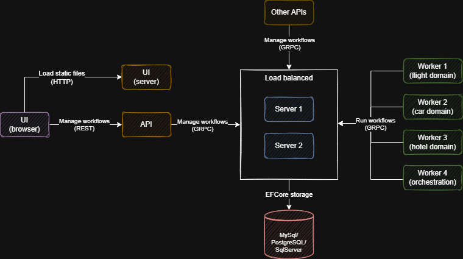
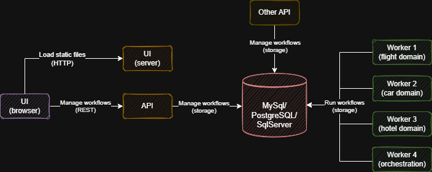
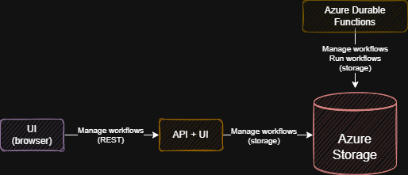

# Durable Task Extensions  

## Introduction

[Durable Task Framework](https://github.com/Azure/durabletask) is an open source framework that provides a foundation for workflow as code in .NET platform.

This project aims to extend it with:
- .NET Dependency Injection and Hosting integration  
- Administrative and monitoring UI
- EFCore storage with support for InMemory, MySQL, PostgreSQL, SQL Server and some [extra features](./src/LLL.DurableTask.EFCore/README.md#features).
- Storage delegation via GRPC protocol

### Related projects

#### [Azure Durable Functions](https://docs.microsoft.com/en-us/azure/azure-functions/durable/durable-functions-overview)

Builds on top of Durable Task Framework to deliver a serverless workflow as code product focused on Azure.

#### [Cadence](https://cadenceworkflow.io/) and [Temporal](https://temporal.io/)

Cadence is a scalable and reliable workflow as code platform built an used by Uber. It is heavily inspired on Durable Functions, but also includes some addicional features like [tasks lists](https://cadenceworkflow.io/docs/concepts/task-lists/) and a [monitoring UI](https://github.com/uber/cadence-web). Cadence features are used as inspiration for this project.

Temporal is a fork of Cadence backed by a company with the same name and founded by the original creators of Cadence. It is under active development and might end up officially supporting .NET clients.

## Components

| Name (click for readme) | Package | Description |
| - | - | - |
| [LLL.DurableTask.Client](src/LLL.DurableTask.Client) |  | DI extensions to configure TaskHubClient. |
| [LLL.DurableTask.Worker](src/LLL.DurableTask.Worker) |  | DI extensions to configure TaskHubWorker. |
| [LLL.DurableTask.Api](src/LLL.DurableTask.Api) |  | Exposes TaskHubClient operations as REST API. |
| [LLL.DurableTask.Ui](src/LLL.DurableTask.Ui) |  | UI to monitor and manage orchestrations. |
| [LLL.DurableTask.Server](src/LLL.DurableTask.Server) |  | Expose storage as API. |
| &nbsp;&nbsp;[LLL.DurableTask.Server.Grpc](src/LLL.DurableTask.Server.Grpc) |  | GRPC endpoints for server. |
| &nbsp;&nbsp;[LLL.DurableTask.Server.Grpc.Client](src/LLL.DurableTask.Server.Grpc.Client) |  | Storage implementation using server GRPC endpoints. |
| [LLL.DurableTask.AzureStorage](src/LLL.DurableTask.AzureStorage) |  | Dependency injection for [Azure Storage](https://github.com/Azure/durabletask/tree/main/src/DurableTask.AzureStorage) |
| [LLL.DurableTask.EFCore](src/LLL.DurableTask.EFCore) |  | EFCore relational database storage implementation with [extra features](./src/LLL.DurableTask.EFCore/README.md#features). |
| &nbsp;&nbsp;[LLL.DurableTask.EFCore.InMemory](src/LLL.DurableTask.EFCore.InMemory) |  | EFCore storage InMemory support. |
| &nbsp;&nbsp;[LLL.DurableTask.EFCore.MySql](src/LLL.DurableTask.EFCore.MySql) |  | EFCore storage MySql support. |
| &nbsp;&nbsp;[LLL.DurableTask.EFCore.PostgreSQL](src/LLL.DurableTask.EFCore.PostgreSQL) |  | EFCore storage PostgreSQL support. |
| &nbsp;&nbsp;[LLL.DurableTask.EFCore.SqlServer](src/LLL.DurableTask.EFCore.SqlServer) |  | EFCore storage Sql Server support. |

## Comparing Storage Providers

The following table compares the EFCore storage providers from this project.

| Feature | EFCore PostgreSQL | EFCore MySQL | EFCore SQL Server | EFCore InMemory | [Others][ms-compare] |
| - | - | - | - | - | - |
| External dependencies | PostgreSQL | MySQL | SQL Server | None | [Compare][ms-compare] |
| Durable Entities | No | No | No | No | [Compare][ms-compare] |
| Disconnected environment | Yes | Yes | Yes | Yes | [Compare][ms-compare] |
| Identity-based connections | Yes¹ | Yes¹ | Yes¹ | N/A | [Compare][ms-compare] |
| Maximum throughput | Moderate | Moderate | Moderate | Moderate | [Compare][ms-compare] |
| Maturity | Not battle-tested | Used in production | Not battle-tested | Development only | [Compare][ms-compare] |
| [Worker specialization][efcore-features] | Supported | Supported | Supported | Supported | No |
| [Input/output observability][efcore-features] | Yes | Yes | Yes | Yes | No |
| [Enhanced rewind][efcore-features] | Yes | Yes | Yes | Yes | No |
| [Orchestration tags][efcore-features] | Yes | Yes | Yes | Yes | No |
| [Full execution history][efcore-features] | Yes | Yes | Yes | Yes | No |
| [Reliable event delivery][efcore-features] | Yes | Yes | Yes | Yes | No |

¹ Supported via EFCore database provider configuration (e.g. Azure AD / Entra ID tokens). Not built into this project directly.

[ms-compare]: https://learn.microsoft.com/en-us/azure/azure-functions/durable/durable-functions-storage-providers#comparing-storage-providers
[efcore-features]: src/LLL.DurableTask.EFCore/README.md#features

### Performance Benchmarks

Benchmark running 100 orchestrations with 5 activities each (lower is better):

| Storage Provider | Median | Mean | Std Dev |
| - | - | - | - |
| EFCore InMemory | 1.56 s | 1.88 s | 0.51 s |
| EFCore PostgreSQL | 2.75 s | 2.53 s | 0.37 s |
| EFCore SQL Server | 3.90 s | 3.77 s | 0.54 s |
| EFCore MySQL | 3.88 s | 3.85 s | 0.26 s |
| DurableTask SQL Server¹ | 2.33 s | 2.34 s | 0.07 s |
| Azure Storage (Azurite)¹ | 8.53 s | 8.40 s | 0.89 s |

¹ Included for reference. [Azure Storage](https://github.com/Azure/durabletask/tree/main/src/DurableTask.AzureStorage) and [DurableTask SQL Server](https://github.com/microsoft/durabletask-mssql) are separate Microsoft packages.

> **Note:** Benchmarks were run locally using Docker containers with [BenchmarkDotNet](https://benchmarkdotnet.org/) on Apple M1 Pro, .NET 9 (3 warmup + 10 iterations). Azure Storage used the Azurite emulator. Results may vary between runs and environments — these numbers are useful for relative comparison, not absolute performance. See [benchmark source](benchmark/StoragesBenchmark) for details.

### Composability

Our components were designed to be independent and highly composable. See below some possible architectures.

#### Microservices with server

#### Microservices with direct storage connection

#### Single service

#### UI for Durable Functions

## Sample

See [samples](samples) for an implementation of the classic book Flight, Car, Hotel with compensation problem using all componentes from above.
