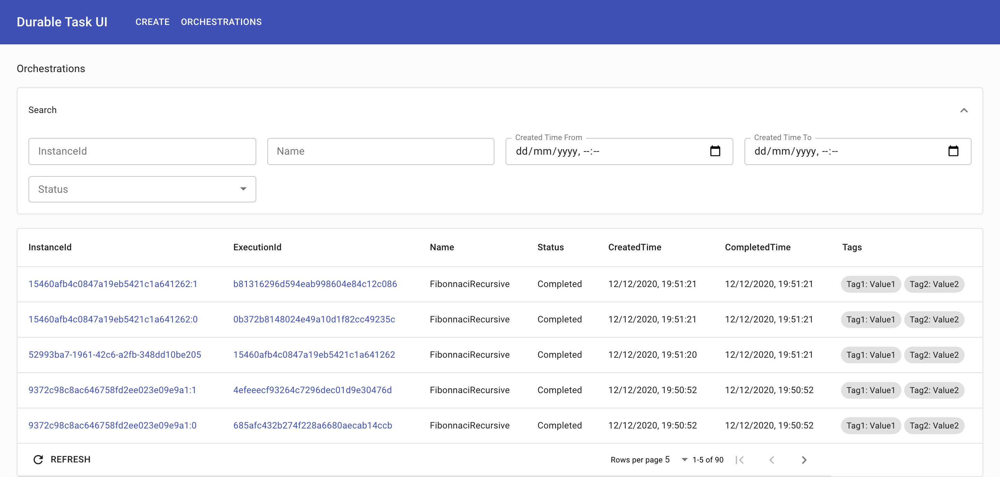
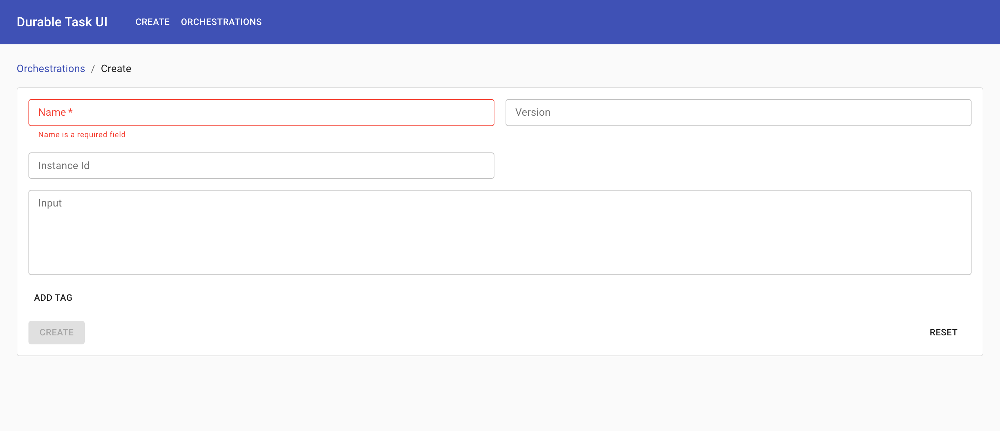
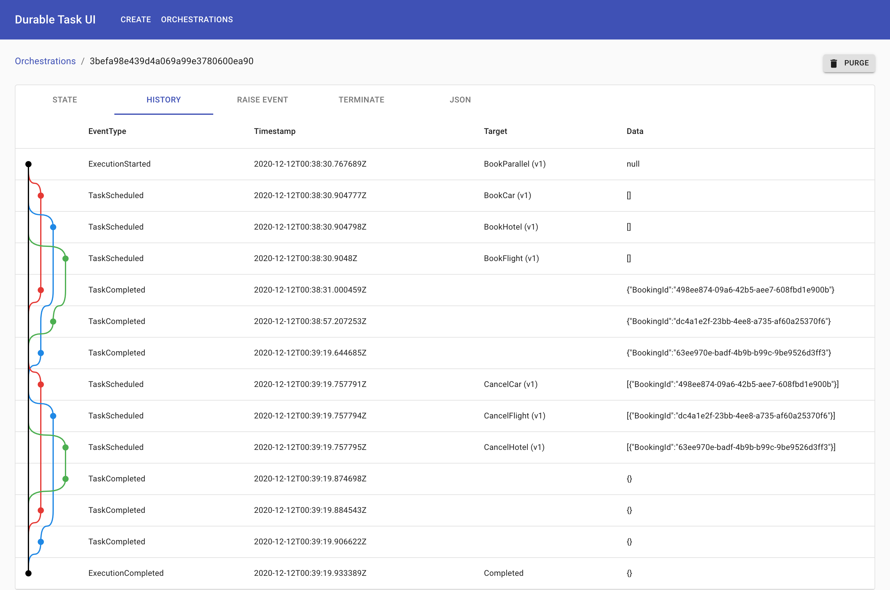
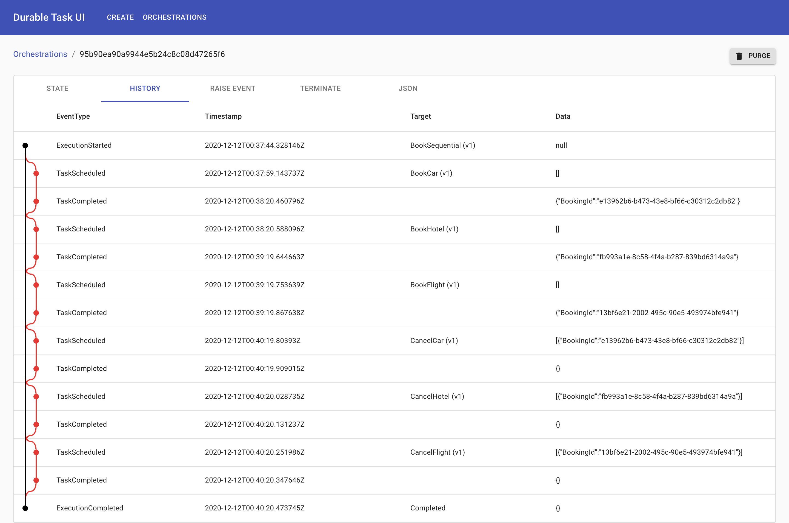
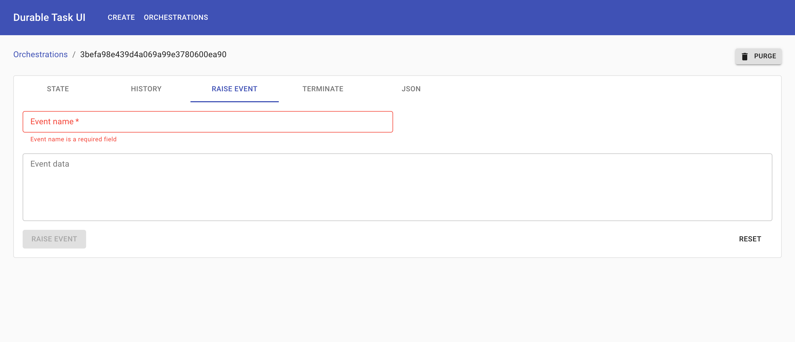
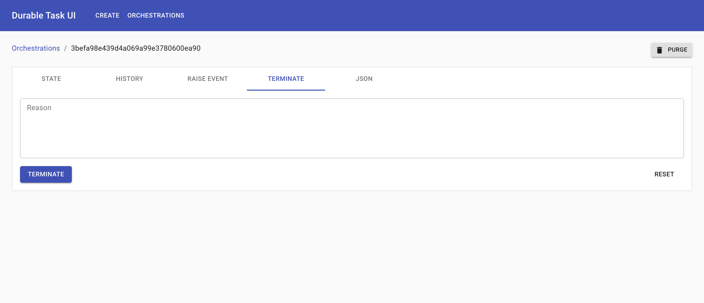
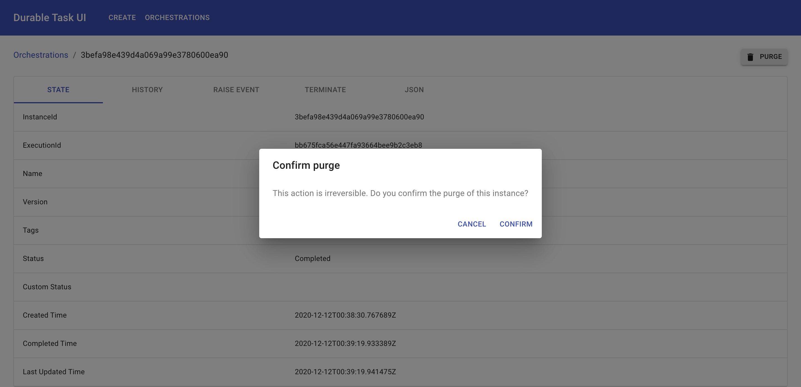

# Durable Task UI Screenshots

## List and search orchestrations

### Create orchestration

## View orchestration

## Orchestration history visualization

## Raise orchestration event

## Terminate orchestration

## Purge orchestration

